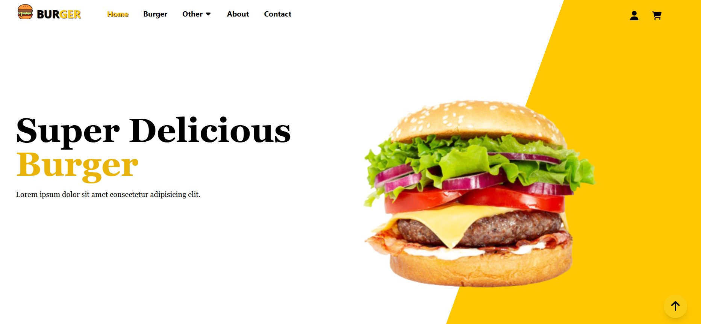
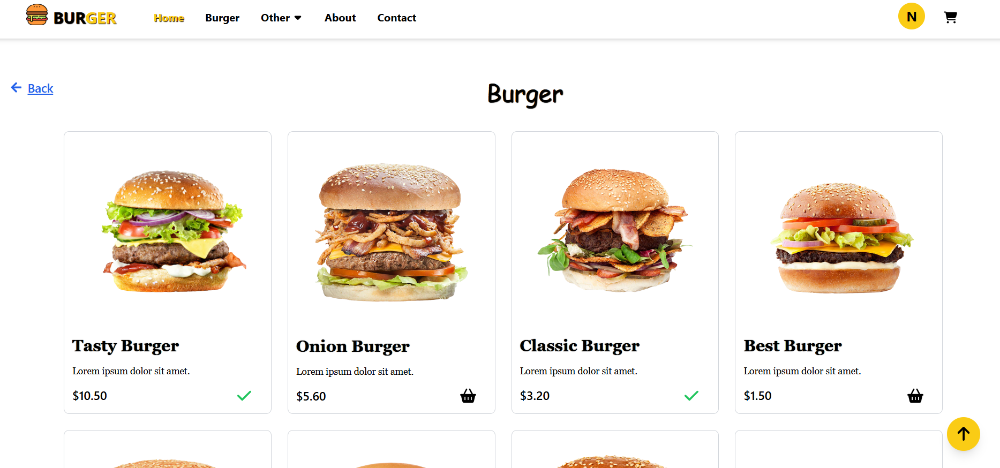
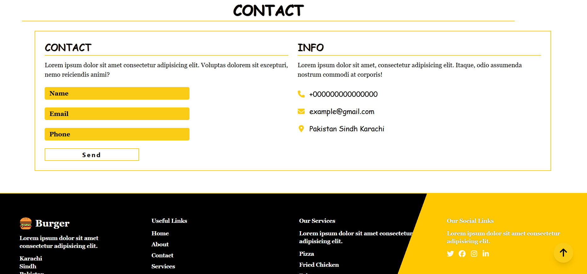
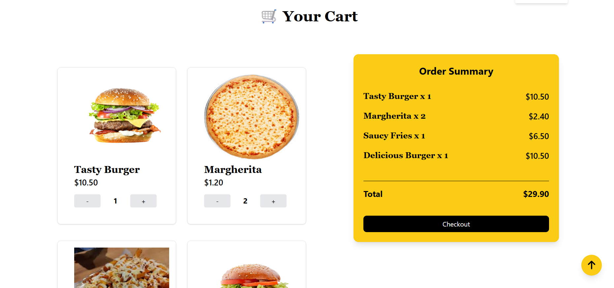

# 🍔 Burger 


## ✨ About    
Burger Website is a modern and fully responsive food ordering website that has been designed using the frontend technologies of ⚛️ React and 🎨 Tailwind CSS.
This project has been developed for the purpose of practicing real-world front-end development concepts like responsive web design, reusability, interactive UI, and modern layouts.

The features include 🍟 an impressive homepage, 📱 responsive navigation bar, 🍔 burger menu section, ✨ attractive food cards, and 📲 mobile-friendly design to provide a smooth user experience across all devices.


## 🚀 Features

``` text
📱 Responsive Navbar
🍔 Mobile Menu Toggle
🎨 Modern UI Design
💻 Fully Responsive Layout
♻️ Reusable React Components
⚡ Fast Performance with Vite
📂 Clean and Organized Code Structure
✨ Interactive User Interface
``` 

## 🛠️ Tech Stack


## ✨ Screenshots

<p align="center">
    
    
</p>
<p align="center">
    
    
</p>


## 🎯 Purpose of the Project

The main purpose of this project is to improve frontend development skills by building a real-world responsive food website using modern web technologies and component-based architecture.

## 📂 Folder Structure
``` text
│
├── images
├── public
├── src
├── .gitignore
├── esllint.config.js
├── index.html
├── package-lock.json
├── package.json
├── postcss.config.js
├── README.md
├── tailwind.config.js
└── vite.config.js

```